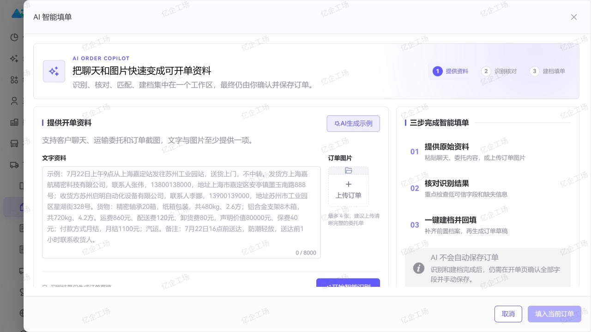

<div align="center">
  <h1>Art Supabase TMS</h1>
  <p><strong>覆盖主数据、开单、调度、运输执行、在途监控与签收协同的智慧运输应用</strong></p>
  <p>把客户委托、运输资源、履约过程、移动司机端与财务结算连接成一条可追踪的运输链路。</p>

  <p>
    <a href="https://gitee.com/wangyanghub/art-supabase-tms">Gitee</a>
    ·
    <a href="https://github.com/869123771/art-supabase-tms">GitHub</a>
    ·
    <a href="https://gitee.com/wangyanghub/art-supabase-pro">主平台</a>
    ·
    <a href="https://gitee.com/wangyanghub/supabase-mobile-tms-driver">司机端</a>
    ·
    <a href="https://869123771.github.io/art-supabase-doc/modules/tms">使用文档</a>
  </p>
</div>

## 项目定位

Art Supabase TMS 是 Art Supabase Pro 的运输管理业务应用，面向物流运输从主数据、订单和运单生成，到配载、在途、签收与财务协作的完整履约过程。

本仓只维护 TMS 页面、业务 API、领域类型、运输规则与专属 Edge Functions。认证、租户、菜单、权限、布局、路由、公共组件、Store 和 Supabase 公共客户端由 [`art-supabase-pro`](https://gitee.com/wangyanghub/art-supabase-pro) 统一提供。




## 核心能力

| 领域       | 已覆盖能力                                                                |
| ---------- | ------------------------------------------------------------------------- |
| 运输主数据 | 客户、客户地址、常用线路、货物、承运商、司机、站点、合同与客户/承运商价格 |
| 开单与订单 | 工作区开单、AI 文本/图片识别、主数据匹配、订单列表、订单详情与状态跟踪    |
| 运力与调度 | 运力规划、待运载、配载、司机车辆组合与运输资源校验                        |
| 运输执行   | 运单详情、运输事件、装卸货、发车、到达、签收、回单与异常处置              |
| 运营监控   | 实时在途地图、车辆/运单视图、线路绩效、运输告警与 AI 异常研判             |
| 跨域协同   | 司机移动端执行、VMS 车辆引用、FMS 费用/结算与平台审批工作流               |

## 标准履约链路

```text
客户委托
  → 开单 / AI 识别
  → 订单与运单
  → 运力规划与配载
  → 装货 / 发车 / 在途
  → 到达 / 卸货 / 签收
  → 回单 / 费用 / 对账与利润
```

AI 智能填单只生成可复核草稿；调度推荐和异常研判只提供辅助判断。保存、改派、签收、费用与状态变化仍由有权限的操作人员确认，并由服务端业务规则约束。

## 司机端协同

独立的 [`supabase-mobile-tms-driver`](https://gitee.com/wangyanghub/supabase-mobile-tms-driver) 提供 H5 与微信小程序司机工作台。司机可接单，完成装卸货定位打卡、发车、到达、签收、收车、凭证上传与费用上报；所有记录通过受控契约回流同一条 TMS 运单履约链路。

## 独立运行

环境要求：Node.js `>= 22.0.0`、pnpm `>= 11.9.0`。

```powershell
pnpm install
pnpm dev
```

默认访问 `http://localhost:3016`。使用在途地图时还需配置高德地图浏览器 Key、安全码和允许域名。

```powershell
pnpm check
pnpm build
pnpm preview
```

生产构建输出到 `docs/`，默认公共路径为 `/art-supabase-tms/`，可作为 Pages 发布目录。

## 与主仓协作

TMS 业务修改在本仓提交并推送，随后在主仓更新 `modules/art-supabase-tms` 子模块指针。数据库菜单继续使用稳定的 `/tms/...` 路由前缀；跨模块读取通过租户隔离、字段最小化的 API/RPC 契约完成，本仓不直接导入其他业务仓源码。

## 安全原则

- 前端菜单和按钮只改善交互，RLS、RPC 与 Edge Functions 才是最终授权边界。
- 普通用户只使用租户范围内的安全数据；受控写入和状态变化必须经过服务端校验。
- 前端只配置 Supabase `anon` / publishable key，服务端密钥不得进入 Vite 环境变量。

## 许可证

本项目采用 [MulanPSL-2.0](LICENSE) 许可证。
